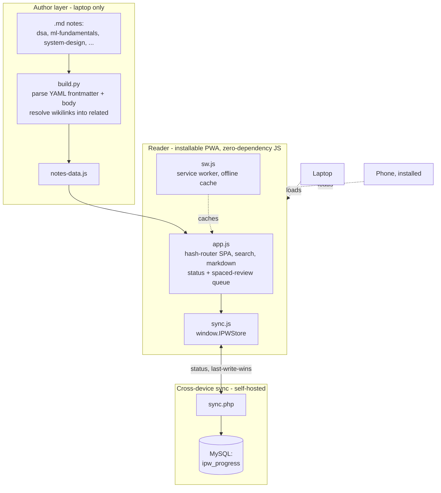

# Interview Prep Wiki

[](build.py)
[-F7DF1E?logo=javascript&logoColor=black)](app/app.js)
[](server/sync.php)
[](app/manifest.webmanifest)
[](server/schema.sql)
[](https://www.linkedin.com/in/sri-sai-ajith-mandava-ba73a7183/)
[](https://github.com/ajithsai5)

---

A **compounding, LLM-maintained knowledge base** for ML/AI-engineer interview prep —
paired with a custom, **zero-dependency Progressive Web App** that installs on your
phone, works **fully offline**, and **syncs your study progress across devices**
through a tiny self-hosted **PHP + MySQL** backend.

The notes are plain Markdown (the source of truth, version-controlled in Git). A
Python build step compiles them into a browsable wiki; a hand-written vanilla-JS
single-page app renders it with search, status tracking, and a spaced-review queue.
No frontend framework, no bundler, no runtime dependencies in the browser.

---

## Highlights

- 🧠 **Compounding wiki pattern** — an LLM reads sources and *maintains* an interlinked
  Markdown knowledge base (cross-references, summaries, an index, a changelog) instead
  of re-deriving answers on every query.
- ⚡ **Zero-dependency SPA reader** — hash-router, client-side Markdown, instant search,
  collapsible domain → sub-folder navigation, dark/light theme. ~1,000 lines of plain JS.
- 📱 **Installable, offline-first PWA** — Web App Manifest + a Service Worker with
  network-first (pages) / stale-while-revalidate (assets) caching. Add-to-Home-Screen,
  works on a plane.
- 🔄 **Cross-device progress sync** — mark a note *Mastered* on your phone, see it on the
  laptop. Self-hosted (PHP + MySQL), **offline-capable** (changes queue and flush on
  reconnect), **last-write-wins** conflict resolution. Pluggable: local-only, self-hosted,
  or Firebase — auto-detected.
- 🗓️ **Spaced repetition built in** — every page tracks New → Learning → Reviewing →
  Mastered and resurfaces on a spaced schedule before you forget.
- 🛠️ **Python build pipeline** — stdlib-only; scans the note folders, parses YAML
  frontmatter, derives domains from folders and *related* links from `[[wikilinks]]`.

---

## Architecture



**Three clean layers, one direction of flow.** Markdown is authored only on the laptop
and compiled to data; the PWA renders that data and is the only thing the phone loads;
sync moves *just the status* (never the note text) through the server.

---

## Features

| Area | What it does |
|---|---|
| **Reading** | Rendered Markdown with tables, code blocks, and `[[wikilinks]]`; unwritten links show as “no page yet” to-dos |
| **Navigation** | Sidebar grouped by domain → sub-folder (e.g. DSA → Arrays / Hashing), status dots, breadcrumb, instant search (`/`) |
| **Learning loop** | Per-note status (New / Learning / Reviewing / Mastered) + a spaced-review queue and home dashboard with coverage bars |
| **Offline** | Full PWA: installs to the home screen, opens with no network, re-syncs when back online |
| **Sync** | Phone ↔ laptop progress sync via a self-hosted PHP/MySQL endpoint (or Firebase), passphrase-gated, offline-queued |
| **Aesthetic** | “Warm-paper editorial” theme — literary serif for reading, mono for code, one terracotta accent, oklch color tokens, dark mode |

---

## Tech stack

| Layer | Technology |
|---|---|
| Notes / source of truth | Markdown + YAML frontmatter, Git |
| Build tooling | **Python 3** (standard library only — no pip deps) |
| Reader (frontend) | **Vanilla JavaScript** (no framework), HTML, CSS (oklch tokens), `marked` for Markdown |
| App platform | **PWA** — Web App Manifest + Service Worker (Cache API) |
| Sync backend | **PHP + MySQL** (PDO, last-write-wins) — or **Firebase/Firestore**, optional |
| Hosting | Any static host (self-hosted Apache/WordPress subfolder, or open `index.html` directly) |

---

## Quick start

```bash
# 1. Generate the wiki data from the Markdown notes
python build.py

# 2a. Open it (Windows one-click: build + open on laptop + serve to phone)
run.bat
#    …or cross-platform:
python build.py --serve --open      # serves at http://localhost:8765
```

Then mark pages **New → Learning → Reviewing → Mastered** — the review queue brings them
back on a spaced schedule. Add or edit a `.md` file, re-run `build.py`, and it shows up.

**Install on your phone + sync across devices:** see **[SELF-HOSTED-SYNC.md](SELF-HOSTED-SYNC.md)**.

---

## Project structure

```
interview-wiki/
├─ build.py              # scans .md notes → generates app/notes-data.js
├─ run.bat               # one click: build + open on laptop + serve to phone
├─ CLAUDE.md             # the schema: how the LLM maintains the wiki
├─ index.md  ·  log.md   # catalog + append-only changelog
├─ app/                  # the PWA reader
│  ├─ index.html  app.js  styles.css
│  ├─ sw.js  manifest.webmanifest  icons/
│  ├─ sync.js            # window.IPWStore: local / self-hosted / Firebase sync
│  └─ notes-data.js      # generated from the .md notes
├─ server/               # self-hosted sync backend
│  ├─ sync.php           # PHP + MySQL endpoint (last-write-wins)
│  └─ schema.sql
├─ dsa/                  # notes — Arrays & Hashing tracks (diagrams + worked examples)
├─ ml-fundamentals/  system-design/  behavioral/  recruiter-hm/
└─ raw/                  # immutable source material the wiki is compiled from
```

---

## The “LLM Wiki” idea behind it

Most LLM-document workflows are RAG: retrieve chunks at query time and re-derive the
answer every time. This flips that — the LLM **incrementally builds and maintains a
persistent wiki** that sits between you and the raw sources. New material is read once,
integrated into entity/concept pages, cross-referenced, and logged. The knowledge is
*compiled once and kept current*, not re-derived on every question.

[`CLAUDE.md`](CLAUDE.md) is the schema that turns a generic chatbot into a disciplined
wiki maintainer (page conventions, ingest/query/lint workflows, status vocabulary).

---

## What it’s for

A focused prep system for ML/AI-engineer interviews, organized by phase:

| Phase | Focus | Lives in |
|---|---|---|
| 2 & 4 | DSA / coding patterns | `dsa/` |
| 5 | ML/AI fundamentals | `ml-fundamentals/` |
| 6 | ML system design | `system-design/` |
| 7 | Behavioral (STAR) | `behavioral/` |
| 3 & 8 | Recruiter / hiring-manager | `recruiter-hm/` |

---

## Author

**Sri Sai Ajith Mandava**
[](https://www.linkedin.com/in/sri-sai-ajith-mandava-ba73a7183/)
[](https://github.com/ajithsai5)
